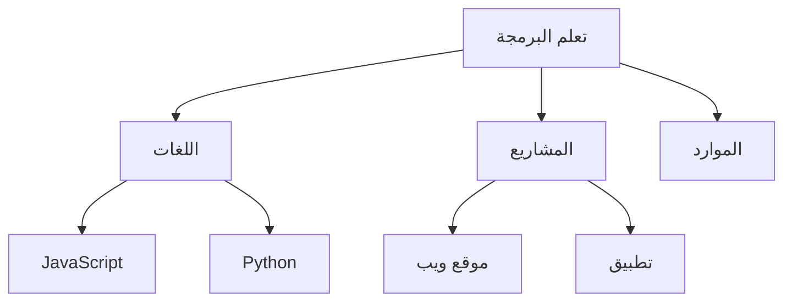

# 🧠 دليل المخططات الذهنية الشامل

> كيف تنظم أفكارك وتخطط مشاريعك بالمخططات الذهنية

---

## 📋 المحتويات

1. [مقدمة](#مقدمة)
2. [أساسيات المخططات](#أساسيات-المخططات)
3. [أنواع المخططات](#أنواع-المخططات)
4. [التحويل لـ JSON](#التحويل-لـ-json)
5. [أمثلة عملية](#أمثلة-عملية)
6. [أدوات مفيدة](#أدوات-مفيدة)

---

## 🌟 مقدمة

### شنو هي المخططات الذهنية؟

المخططات الذهنية (Mind Maps) هي طريقة لتنظيم الأفكار بشكل بصري. تخيلها مثل شجرة:
- **الجذع:** الفكرة الرئيسية
- **الفروع:** الأفكار الفرعية
- **الأوراق:** التفاصيل

### ليش نستخدمها؟

- **تنظيم الأفكار:** بدل الفوضى، كل شي منظم
- **الإبداع:** تساعدك تطلع أفكار جديدة
- **التذكر:** الصور والألوان تساعد على التذكر
- **التخطيط:** ممتازة للمشاريع والدراسة

---

## 🎨 أساسيات المخططات

### 1. العناصر الأساسية

#### أ. الموضوع المركزي
الفكرة الرئيسية، تكون في الوسط:

```
        ┌─────────────────┐
        │  تعلم البرمجة  │
        └─────────────────┘
```

#### ب. الفروع الرئيسية
الأفكار الكبيرة، تطلع من المركز:

```
                تعلم البرمجة
                     │
        ┌────────────┼────────────┐
        │            │            │
     اللغات      المشاريع      الموارد
```

#### ج. الفروع الفرعية
التفاصيل، تطلع من الفروع الرئيسية:

```
                تعلم البرمجة
                     │
        ┌────────────┼────────────┐
        │            │            │
     اللغات      المشاريع      الموارد
        │            │            │
    ┌───┼───┐    ┌───┼───┐    ┌───┼───┐
    │   │   │    │   │   │    │   │   │
   JS  Py C++  موقع تطبيق لعبة كتب كورسات يوتيوب
```

### 2. قواعد المخططات الجيدة

#### القاعدة 1: ابدأ من المركز
```
✅ صح:
        الموضوع
           │
        الفروع

❌ غلط:
الفرع 1
الفرع 2
الموضوع
```

#### القاعدة 2: استخدم كلمات مفتاحية
```
✅ صح: "تعلم Python"
❌ غلط: "أريد أن أتعلم لغة البرمجة Python من الصفر"
```

#### القاعدة 3: استخدم الألوان
```
🔴 أحمر: مهم وعاجل
🟡 أصفر: مهم غير عاجل
🟢 أخضر: مكتمل
🔵 أزرق: معلومات
```

#### القاعدة 4: أضف رموز
```
📚 كتب
🎥 فيديوهات
💻 كود
✅ مكتمل
⏳ قيد التنفيذ
```

---

## 📊 أنواع المخططات

### 1. المخطط الشجري (Tree Map)

الأكثر شيوعاً، يشبه الشجرة:

```
                    المشروع
                       │
        ┌──────────────┼──────────────┐
        │              │              │
    التخطيط        التطوير         النشر
        │              │              │
    ┌───┼───┐      ┌───┼───┐      ┌───┼───┐
    │   │   │      │   │   │      │   │   │
  فكرة تصميم موارد  كود تست تحسين  سيرفر دومين تسويق
```

### 2. المخطط الدائري (Radial Map)

الفروع تطلع من المركز بشكل دائري:

```
              اللغات
                │
    الموارد ────┼──── المشاريع
                │
             الأدوات
```

### 3. المخطط الانسيابي (Flow Map)

يوضح التسلسل والخطوات:

```
البداية → التخطيط → التطوير → الاختبار → النشر → النهاية
```

### 4. المخطط المفاهيمي (Concept Map)

يوضح العلاقات بين المفاهيم:

```
    HTML
      │
      ├─ يحتوي على ─→ عناصر
      │                  │
      │                  ├─ div
      │                  ├─ p
      │                  └─ a
      │
      └─ يستخدم مع ─→ CSS
                          │
                          └─ يستخدم مع ─→ JavaScript
```

---

## 💾 التحويل لـ JSON

### مثال 1: مخطط بسيط

**المخطط:**
```
        تعلم JavaScript
              │
        ┌─────┼─────┐
        │     │     │
    أساسيات متقدم مشاريع
```

**JSON:**
```json
{
  "topic": "تعلم JavaScript",
  "branches": [
    {
      "name": "أساسيات",
      "items": []
    },
    {
      "name": "متقدم",
      "items": []
    },
    {
      "name": "مشاريع",
      "items": []
    }
  ]
}
```

### مثال 2: مخطط متعدد المستويات

**المخطط:**
```
                تطوير تطبيق موبايل
                        │
        ┌───────────────┼───────────────┐
        │               │               │
    التخطيط          التطوير          النشر
        │               │               │
    ┌───┼───┐       ┌───┼───┐       ┌───┼───┐
    │   │   │       │   │   │       │   │   │
  فكرة تصميم ميزانية  كود تست تحسين  متجر تسويق دعم
```

**JSON:**
```json
{
  "project": "تطوير تطبيق موبايل",
  "phases": [
    {
      "name": "التخطيط",
      "tasks": [
        {
          "name": "فكرة",
          "description": "تحديد فكرة التطبيق",
          "status": "مكتمل"
        },
        {
          "name": "تصميم",
          "description": "تصميم الواجهات",
          "status": "قيد التنفيذ"
        },
        {
          "name": "ميزانية",
          "description": "حساب التكاليف",
          "status": "لم يبدأ"
        }
      ]
    },
    {
      "name": "التطوير",
      "tasks": [
        {
          "name": "كود",
          "description": "كتابة الكود",
          "status": "لم يبدأ"
        },
        {
          "name": "تست",
          "description": "اختبار التطبيق",
          "status": "لم يبدأ"
        },
        {
          "name": "تحسين",
          "description": "تحسين الأداء",
          "status": "لم يبدأ"
        }
      ]
    },
    {
      "name": "النشر",
      "tasks": [
        {
          "name": "متجر",
          "description": "رفع على المتاجر",
          "status": "لم يبدأ"
        },
        {
          "name": "تسويق",
          "description": "الترويج للتطبيق",
          "status": "لم يبدأ"
        },
        {
          "name": "دعم",
          "description": "دعم المستخدمين",
          "status": "لم يبدأ"
        }
      ]
    }
  ]
}
```

### مثال 3: مخطط معرفي

**المخطط:**
```
                    Python
                      │
        ┌─────────────┼─────────────┐
        │             │             │
    الأساسيات      المكتبات      المشاريع
        │             │             │
    ┌───┼───┐     ┌───┼───┐     ┌───┼───┐
    │   │   │     │   │   │     │   │   │
  متغيرات حلقات دوال  NumPy Pandas Django  ويب API تحليل
```

**JSON:**
```json
{
  "language": "Python",
  "learning_path": {
    "basics": {
      "name": "الأساسيات",
      "topics": [
        {
          "name": "متغيرات",
          "level": "مبتدئ",
          "duration": "1 أسبوع",
          "resources": [
            "https://youtube.com/...",
            "https://w3schools.com/python"
          ]
        },
        {
          "name": "حلقات",
          "level": "مبتدئ",
          "duration": "1 أسبوع",
          "resources": []
        },
        {
          "name": "دوال",
          "level": "مبتدئ",
          "duration": "2 أسبوع",
          "resources": []
        }
      ]
    },
    "libraries": {
      "name": "المكتبات",
      "topics": [
        {
          "name": "NumPy",
          "level": "متوسط",
          "use_case": "العمليات الرياضية",
          "duration": "2 أسبوع"
        },
        {
          "name": "Pandas",
          "level": "متوسط",
          "use_case": "تحليل البيانات",
          "duration": "3 أسبوع"
        },
        {
          "name": "Django",
          "level": "متقدم",
          "use_case": "تطوير الويب",
          "duration": "4 أسبوع"
        }
      ]
    },
    "projects": {
      "name": "المشاريع",
      "list": [
        {
          "name": "موقع ويب",
          "description": "موقع شخصي بـ Django",
          "difficulty": "متوسط",
          "duration": "2 أسبوع"
        },
        {
          "name": "API",
          "description": "REST API للمهام",
          "difficulty": "متوسط",
          "duration": "1 أسبوع"
        },
        {
          "name": "تحليل بيانات",
          "description": "تحليل بيانات مبيعات",
          "difficulty": "متقدم",
          "duration": "3 أسبوع"
        }
      ]
    }
  }
}
```

---

## 🎯 أمثلة عملية

### مثال 1: تخطيط مشروع تخرج

```json
{
  "graduation_project": {
    "title": "نظام إدارة مكتبة",
    "duration": "6 أشهر",
    "team_size": 4,
    "phases": {
      "month_1": {
        "name": "التخطيط والتحليل",
        "tasks": [
          "دراسة الجدوى",
          "جمع المتطلبات",
          "تحليل النظام الحالي",
          "تحديد المتطلبات الوظيفية"
        ],
        "deliverables": [
          "وثيقة المتطلبات",
          "مخططات UML"
        ]
      },
      "month_2": {
        "name": "التصميم",
        "tasks": [
          "تصميم قاعدة البيانات",
          "تصميم الواجهات",
          "تصميم المعمارية"
        ],
        "deliverables": [
          "مخططات قاعدة البيانات",
          "نماذج الواجهات"
        ]
      },
      "month_3_4": {
        "name": "التطوير",
        "tasks": [
          "تطوير Backend",
          "تطوير Frontend",
          "ربط قاعدة البيانات",
          "تطوير الميزات"
        ],
        "deliverables": [
          "النظام الأولي"
        ]
      },
      "month_5": {
        "name": "الاختبار",
        "tasks": [
          "اختبار الوحدات",
          "اختبار التكامل",
          "اختبار المستخدم",
          "إصلاح الأخطاء"
        ],
        "deliverables": [
          "تقرير الاختبار"
        ]
      },
      "month_6": {
        "name": "التوثيق والنشر",
        "tasks": [
          "كتابة الوثائق",
          "إعداد العرض التقديمي",
          "نشر النظام",
          "التدريب"
        ],
        "deliverables": [
          "الوثائق الكاملة",
          "العرض التقديمي",
          "النظام النهائي"
        ]
      }
    },
    "technologies": {
      "frontend": ["React", "Bootstrap"],
      "backend": ["Node.js", "Express"],
      "database": ["MongoDB"],
      "tools": ["Git", "VS Code", "Postman"]
    }
  }
}
```

### مثال 2: خطة تعلم شخصية

```json
{
  "learning_plan": {
    "goal": "أصير مطور Full Stack",
    "timeline": "12 شهر",
    "current_level": "مبتدئ",
    "target_level": "متوسط-متقدم",
    "quarters": [
      {
        "q": 1,
        "focus": "Frontend Basics",
        "months": [
          {
            "month": 1,
            "topics": ["HTML", "CSS"],
            "projects": ["صفحة شخصية", "صفحة هبوط"],
            "hours_per_day": 2
          },
          {
            "month": 2,
            "topics": ["JavaScript Basics"],
            "projects": ["حاسبة", "لعبة تخمين"],
            "hours_per_day": 2
          },
          {
            "month": 3,
            "topics": ["JavaScript Advanced", "DOM"],
            "projects": ["قائمة مهام", "مشغل موسيقى"],
            "hours_per_day": 3
          }
        ]
      },
      {
        "q": 2,
        "focus": "Frontend Framework",
        "months": [
          {
            "month": 4,
            "topics": ["React Basics"],
            "projects": ["تطبيق طقس", "مدونة بسيطة"],
            "hours_per_day": 3
          },
          {
            "month": 5,
            "topics": ["React Advanced", "Redux"],
            "projects": ["متجر إلكتروني"],
            "hours_per_day": 3
          },
          {
            "month": 6,
            "topics": ["Next.js"],
            "projects": ["موقع شخصي احترافي"],
            "hours_per_day": 3
          }
        ]
      },
      {
        "q": 3,
        "focus": "Backend",
        "months": [
          {
            "month": 7,
            "topics": ["Node.js", "Express"],
            "projects": ["REST API بسيط"],
            "hours_per_day": 3
          },
          {
            "month": 8,
            "topics": ["MongoDB", "Mongoose"],
            "projects": ["API مع قاعدة بيانات"],
            "hours_per_day": 3
          },
          {
            "month": 9,
            "topics": ["Authentication", "Security"],
            "projects": ["نظام تسجيل دخول"],
            "hours_per_day": 3
          }
        ]
      },
      {
        "q": 4,
        "focus": "Full Stack Projects",
        "months": [
          {
            "month": 10,
            "topics": ["Integration"],
            "projects": ["تطبيق مهام Full Stack"],
            "hours_per_day": 4
          },
          {
            "month": 11,
            "topics": ["Deployment", "DevOps"],
            "projects": ["نشر التطبيقات"],
            "hours_per_day": 4
          },
          {
            "month": 12,
            "topics": ["Portfolio"],
            "projects": ["مشروع تخرج", "Portfolio"],
            "hours_per_day": 4
          }
        ]
      }
    ]
  }
}
```

---

## 🛠️ أدوات مفيدة

### أدوات مجانية:

1. **XMind**
   - مجاني للاستخدام الأساسي
   - سهل الاستخدام
   - يدعم التصدير

2. **MindMeister**
   - أونلاين
   - تعاون جماعي
   - مجاني لـ 3 خرائط

3. **Coggle**
   - بسيط وجميل
   - تعاون فوري
   - مجاني

4. **Draw.io**
   - مجاني تماماً
   - قوي جداً
   - يدعم كل أنواع المخططات

### أدوات برمجية:

```javascript
// مكتبة JavaScript لرسم المخططات
// Mermaid.js


```

---

## 💡 نصائح للإتقان

### 1. ابدأ بسيط
```
❌ لا تبدأ بمخطط معقد فيه 100 فرع
✅ ابدأ بـ 3-5 فروع رئيسية
```

### 2. استخدم الألوان بذكاء
```
🔴 عاجل ومهم
🟡 مهم غير عاجل
🟢 مكتمل
🔵 معلومات إضافية
⚫ أرشيف
```

### 3. راجع وحدّث
```
- راجع المخطط كل أسبوع
- حدّث الحالة
- أضف أفكار جديدة
- احذف القديم
```

### 4. شارك مع الآخرين
```
- خلي زملائك يشوفون المخطط
- اطلب ملاحظات
- تعاون في التخطيط
```

---

## 📚 مصادر إضافية

- [دليل الكتابة](./writing-guide.md)
- [هندسة البرومبتات](./prompt-engineering.md)

---

**آخر تحديث:** 2026-02-02
**الكاتب:** علي الأكبر حيدر
